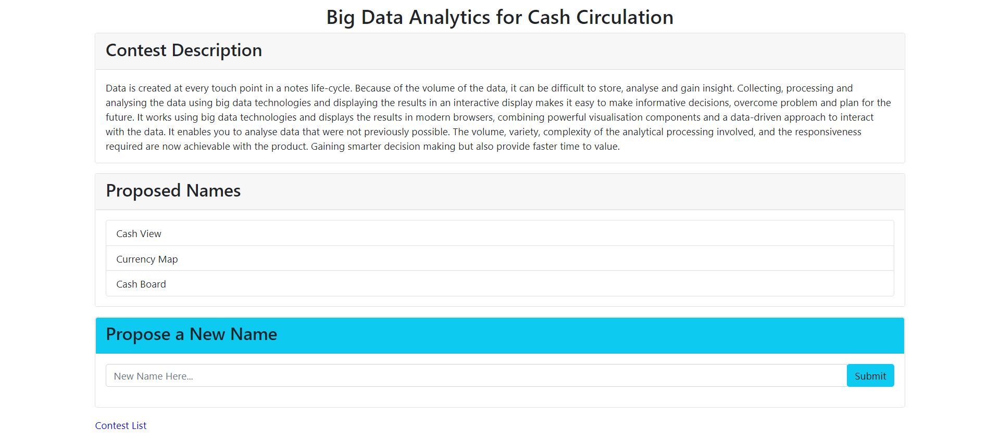

# naming-contest

Full-stack web app using React, NodeJS, and MongoDB

## How to Run

Inside `naming-contests/`, run the following:

1. Install all the node dependencies: `npm install`

2. Load the test data into MongoDB: `./node_modules/.bin/babel-node loadTestData.js`

3. Update the name IDs to use MongoDB's IDs: `./node_modules/.bin/babel-node updateTestData.js`

4. Run webpack (bundle files for the browser): `npm run dev`

5. Run nodemon (node server) in another terminal: `npm start`

6. Open `http://localhost:8080`
